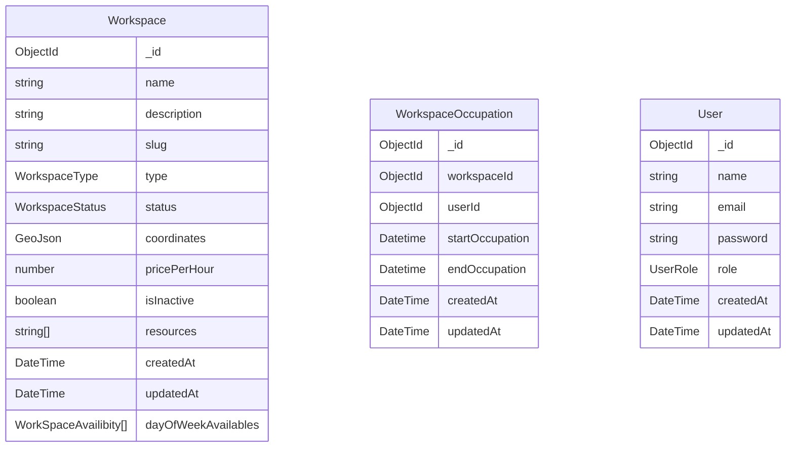

# Overview

Esse projeto é uma sistema para reservas para **Coworking**. O objetivo do projeto é servir como projeto portifólio, aplicando conceitos de **Clean Architecture**, **Domain-Driven** **Design (DDD)**, **cache** e **persistência**.

## 🚀 Funcionalidades

- Gerenciamento de Coworking
    - Gerenciamento de Disponibilidade
    - Gerenciamento de Alocação
- Solicitação de Ocupação
- Pagamento

## Setup local

Gere o keyfile do replica set MongoDB (não versionado):

```bash
openssl rand -base64 756 > backend/docker/mongo-keyfile
```

Suba a infra (MongoDB, Seq, LocalStack) e construa as imagens:

```bash
cd backend
docker compose up -d
docker build -f CoworkingBooking.Api/Dockerfile     -t cwb-api     .
docker build -f CoworkingBooking.Workers/Dockerfile -t cwb-workers .
```

## Diagram ER

