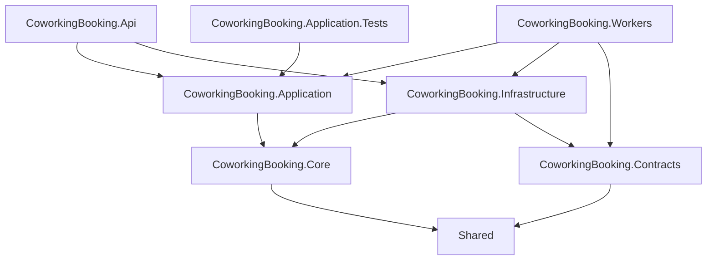
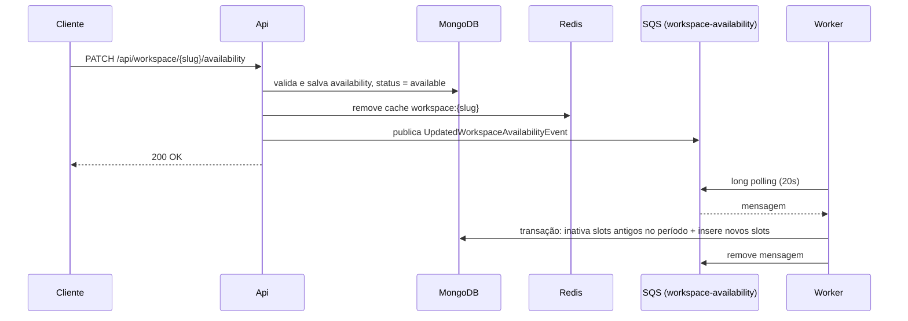
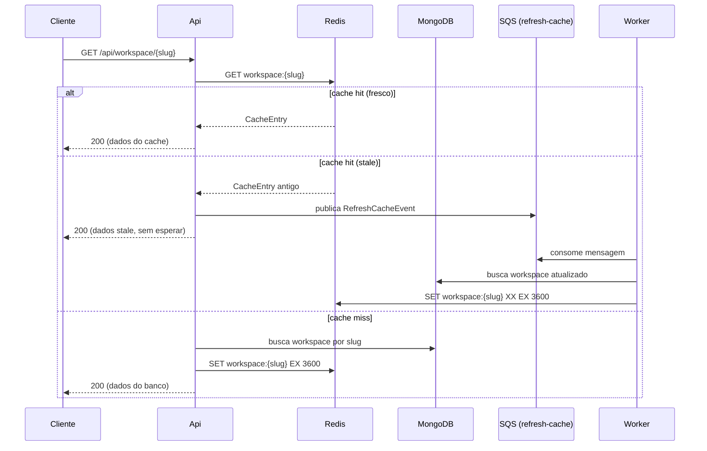

# Arquitetura

O backend segue **Clean Architecture**: o domínio não depende de nenhuma outra camada, os casos de uso dependem só do domínio, e detalhes de infraestrutura (MongoDB, Redis, SQS) ficam nas bordas.

## Camadas



| Projeto | Responsabilidade |
|---|---|
| **Core** | Entidades e value objects (`WorkspaceEntity`, `WorkSpaceAvailability`, `WorkspaceCalendarEntity`), enums, eventos de domínio e interfaces de repositório. |
| **Application** | Casos de uso, DTOs, validadores FluentValidation, mapeadores, portas (publishers, cache) e handler de refresh de cache. |
| **Infrastructure** | Repositórios MongoDB, cache e lock distribuído em Redis, publishers SQS, migrations, gerenciador de transação e cron jobs. |
| **Contracts** | Contratos das mensagens publicadas nas filas. |
| **Shared** | Tipos transversais: `Result<T>`, `Error`, `ApiResponse<T>`, `GeoJson`, `Frequency`, nomes de filas, exceções. |
| **Api** | Controllers REST, serialização JSON, OpenAPI/Scalar, health checks, servidor e dashboard Hangfire. |
| **Workers** | `BackgroundService` que consome as filas SQS. |

## Padrões

### Catálogo

| Padrão | Onde | Para quê |
|---|---|---|
| **Clean Architecture / Ports & Adapters** | Interfaces em Core/Application/Shared (`IWorkspaceRepository`, `ICacheRepository`, `IDistribuedLock`, publishers), implementações em Infrastructure | Domínio e casos de uso não conhecem MongoDB, Redis ou SQS. |
| **Aggregate + Value Object (DDD)** | `WorkspaceEntity`, `WorkspaceCalendarEntity`; `WorkSpaceAvailability`, `WorkSpaceAvailabilityRecurrence` | Regras de negócio e invariantes ficam dentro das entidades. |
| **Factory / Rehydrate** | `WorkspaceEntity.Rehydrate(...)` | Separa a criação de uma entidade nova (com estado inicial `Draft`) da reconstrução a partir do banco. |
| **Domain Event** | `UpdatedWorkspaceAvailabilityEvent` | Comunica a mudança de disponibilidade para processamento assíncrono. |
| **Use Case (Command Handler)** | `IUseCase<TRequest, TResponse>` | Um caso de uso por operação, orquestrando validação, domínio e persistência. |
| **Result Pattern** | `Result<T>`, `Error`, `ErrorType` | Fluxo de erro explícito, sem exceções para erros esperados. |
| **Repository** | `WorkspaceRepository`, `WorkspaceCalendarRepository` | Isola o acesso ao MongoDB e o mapeamento entre models e entidades. |
| **Unit of Work** | `ITransactionManager` (`MongodbTransactionManagerService`) | Agrupa operações em uma transação MongoDB (soft delete + inserção de slots). |
| **Soft Delete** | `isInactive` em `workspaces_calendar` + job de limpeza | Substituição de slots sem perda imediata dos dados, com remoção física posterior. |
| **Cache-Aside + Stale-While-Revalidate** | `RedisCacheRepository` + `WorkspaceRefreshCacheHandler` | Leituras rápidas com atualização do cache fora do caminho da requisição. Veja [Cache](#cache). |
| **Distributed Lock (Mutex)** | `RedisDistribuedLock` | Exclusão mútua entre instâncias. Veja [Lock distribuído](#lock-distribuído-mutex). |
| **Publisher / Consumer (fila)** | Publishers SQS em Infrastructure, consumidores em Workers | Desacopla trabalho pesado ou não urgente da requisição HTTP. |
| **Migrations versionadas** | `AbstractMigration` + `MigrationRunner` | Evolução de índices e dados do MongoDB de forma reprodutível. |

### Casos de uso

Todo caso de uso implementa `IUseCase<TRequest, TResponse>` e retorna `Result<T>`, que carrega o dado em caso de sucesso ou uma lista de `Error` (mensagem + `ErrorType`). Os casos de uso são registrados automaticamente no container de DI.

| Caso de uso | Disparado por |
|---|---|
| `CreateWorkspaceUseCase` | `POST /api/workspace` |
| `GetWorkspaceBySlugUseCase` | `GET /api/workspace/{slug}` |
| `UpdateAvailabilityUseCase` | `PATCH /api/workspace/{slug}/availability` |
| `UpdateWorkspaceStatusUseCase` | `PATCH /api/workspace/{slug}/status` |
| `CreateWorkspaceCalendarBookingUseCase` | `POST /api/workspaceCalendar/{calendarId}/booking` |
| `UpdateWorkspaceCalendarRecurrencesUseCase` | Worker, fila `workspace-availability` |

### Respostas e erros

Os controllers convertem o `Result<T>` em resposta HTTP no formato `ApiResponse<T>` (`{ success, data, errors }`). O `ErrorType` define o status:

| `ErrorType` | HTTP |
|---|---|
| `ValidationError` | 400 |
| `Forbidden` | 403 |
| `NotFound` | 404 |
| `Conflict` | 409 |
| `InternalServerError` | 500 |

Falhas de conexão com o Redis retornam **503** com o header `Retry-After: 10`.

## Fluxo de disponibilidade

Definir a disponibilidade de um workspace é síncrono; a geração dos slots de calendário é assíncrona.



O `UpdateWorkspaceCalendarRecurrencesUseCase` expande a recorrência em um `WorkspaceCalendarEntity` por ocorrência:

- `DAILY`: um slot por dia, de `startAt` até `until`.
- `WEEKLY`: um slot para cada dia listado em `byDay`, até `until`.

Os horários são calculados no timezone informado e armazenados em UTC. Slots substituídos são marcados como inativos (soft delete) na mesma transação MongoDB em que os novos são inseridos.

## Cache

A leitura de workspace por slug (`GetWorkspaceBySlugUseCase`) combina duas estratégias em Redis, implementadas no repositório genérico `RedisCacheRepository<TEntity, TCache>`:

- **Cache-Aside (lazy loading)**: a aplicação consulta o cache primeiro; em caso de miss, busca no MongoDB e grava o resultado no cache.
- **Stale-While-Revalidate (SWR)**: uma entrada considerada antiga continua sendo servida imediatamente, enquanto a revalidação acontece em segundo plano, via fila e Worker. A requisição nunca espera pelo banco por causa de um refresh.

### Estrutura da entrada

Cada valor é um `CacheEntry` serializado em JSON:

```json
{ "Data": { /* workspace */ }, "CreatedAt": 1759406400 }
```

| Item | Valor |
|---|---|
| Chave | `workspace:{slug}` |
| TTL no Redis | 1 hora |
| Idade para considerar a entrada stale | `CreatedAt` com mais de 3600 s |
| Fila de revalidação | `refresh-cache` (`RefreshCacheEvent { cacheType, cacheKey }`) |

### Fluxo de leitura



### Detalhes

- **Revalidação só atualiza chaves existentes**: o `WorkspaceRefreshCacheHandler` grava com `When.Exists` (`SET ... XX`). Se a chave foi invalidada ou expirou enquanto a mensagem estava na fila, o refresh não recria a entrada, e quem decide repopular o cache é a próxima leitura.
- **Invalidação explícita**: quando a disponibilidade do workspace é atualizada, a chave é removida (`DeleteByKey`) para que a próxima leitura traga o dado novo do banco.
- **Extensível**: o repositório é genérico (`ICacheRepository<TEntity, TCache>`), e o refresh é delegado a handlers que implementam `IRefreshCacheHandler`, identificados por `CacheType`.
- **Resiliência**: falhas de conexão com o Redis são convertidas em `503 Service Unavailable` com `Retry-After: 10`.

## Lock distribuído (Mutex)

`RedisDistribuedLock` (`IDistribuedLock`) implementa um **mutex distribuído** em Redis, garantindo que apenas uma instância da aplicação execute uma seção crítica por vez.

```csharp
Task<string?> AcquireLock(string resource, TimeSpan ttl, TimeSpan wait);
Task<bool> ReleaseAsync(string resource, string token);
```

### Aquisição

- A chave do lock é `lock:{resource}`.
- O lock é obtido com uma operação atômica `SET lock:{resource} <token> NX PX <ttl>`: só grava se a chave não existir.
- Enquanto o tempo `wait` não acabar, a aquisição é tentada novamente. Com `wait = 0`, é feita uma única tentativa.
- Retorna o token em caso de sucesso, ou `null` se o lock pertence a outra instância.
- O **TTL** garante que o lock seja liberado automaticamente se o dono cair antes de liberá-lo, evitando deadlock.

### Liberação

A liberação usa um script Lua, executado atomicamente no Redis, que só remove a chave se o valor ainda for o token de quem adquiriu o lock:

```lua
if redis.call('get', KEYS[1]) == ARGV[1] then
    return redis.call('del', KEYS[1])
else
    return 0
end
```

Isso impede que uma instância libere um lock que já expirou e foi adquirido por outra.

### Uso atual

| Recurso | Chave | TTL | Espera | Comportamento |
|---|---|---|---|---|
| Migrations | `lock:migrations` | 120 s | 0 s | A instância que obtém o lock executa as migrations; as demais seguem a inicialização sem executá-las. |

## Jobs agendados

O servidor Hangfire roda dentro da **Api**, com storage em Redis (prefixo `hangfire:`). O dashboard fica em `/jobs`.

| Job | Cron | Ação |
|---|---|---|
| `clean-workspace-calendar-recurrences` | `0 23 * * *` (diário, 23h) | Remove definitivamente os slots de calendário com `isInactive = true`. |

## Workers

`CoworkingBooking.Workers` executa um único `BackgroundService` que alterna entre os consumidores:

| Consumidor | Fila | Ação |
|---|---|---|
| `UpdatedWorkspaceAvailabilityConsumer` | `workspace-availability` | Gera os slots de calendário da nova disponibilidade. |
| `RefreshCacheConsumer` | `refresh-cache` | Atualiza a entrada de cache do workspace. |

Cada consumidor faz long polling (1 mensagem, `WaitTimeSeconds = 20`) e remove a mensagem após processá-la.

## Migrations

As migrations do MongoDB são classes que herdam de `AbstractMigration` (`Up`/`Down`), em `CoworkingBooking.Infrastructure/Migrations/`. O `MigrationRunner` as executa na inicialização da Api, protegido pelo [lock distribuído](#lock-distribuído-mutex) `lock:migrations` para evitar execução concorrente entre instâncias. As migrations aplicadas são registradas na coleção `_migrations`.
