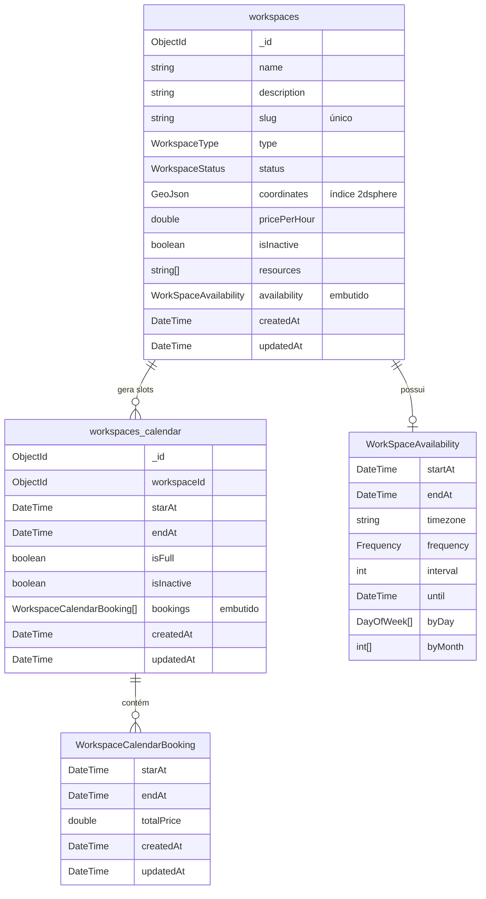

# Domínio

O domínio fica em `backend/CoworkingBooking.Core` e possui dois agregados: **Workspace** e **WorkspaceCalendar**.

## Modelo de dados

## Workspace

Espaço reservável. Entidade: `Core/Workspace/Entities/Workspace.cs`.

**Regras**

- `name`, `description` e `slug` são obrigatórios (espaços nas pontas são removidos).
- `type` e `status` devem ser valores válidos dos enums.
- `coordinates` deve ser `[longitude, latitude]`, com longitude entre -180 e 180 e latitude entre -90 e 90.
- `pricePerHour` deve ser maior ou igual a 0.
- `resources` não pode conter itens vazios.
- Todo workspace novo nasce com status `Draft` e ativo (`isInactive = false`).
- O status só pode ir para `Available` se o workspace tiver uma disponibilidade definida.
- A disponibilidade não pode ser alterada se algum slot de calendário afetado já tiver reserva.

### WorkSpaceAvailability (value object)

Janela de disponibilidade e sua recorrência. Arquivo: `Core/Workspace/Entities/WorkspaceAvailability.cs`.

- `startAt` e `endAt` são convertidos para UTC; `startAt` deve ser anterior a `endAt`.
- A recorrência é obrigatória.
- `DAILY`: `byDay` e `byMonth` devem ser nulos.
- `WEEKLY`: `byDay` é obrigatório.

## WorkspaceCalendar

Cada documento representa **uma ocorrência** (slot) da disponibilidade de um workspace, gerada pelo Worker. Entidade: `Core/WorkspaceCalendar/Entities/WorkspaceCalendar.cs`.

**Regras**

- Não é possível reservar em um slot com `isFull = true`.
- A reserva deve estar dentro da janela do slot (`startAt`..`endAt`).
- A reserva não pode sobrepor outra reserva existente no mesmo slot.
- Quando as reservas cobrem toda a janela do slot, ele é fechado (`isFull = true`).
- Slots substituídos por uma nova disponibilidade são marcados como inativos e removidos pelo job diário.

### WorkspaceCalendarBooking

Reserva dentro de um slot.

- `startAt` deve ser anterior a `endAt`.
- `totalPrice = horas reservadas × pricePerHour` do workspace.

## Enums

**WorkspaceType** (`Core/Workspace/Enums/WorkspaceEnums.cs`)

| Valor | Código |
|---|---|
| `OpenDesk` | 1 |
| `PrivateOffice` | 2 |
| `MeetingRoom` | 3 |
| `EventSpace` | 4 |

**WorkspaceStatus** (`Core/Workspace/Enums/WorkspaceEnums.cs`)

| Valor | Código |
|---|---|
| `Available` | 1 |
| `Reserved` | 2 |
| `Maintenance` | 3 |
| `Unavailable` | 4 |
| `Draft` | 5 |

**Frequency** (`Shared/Enums/FrequencyEnum.cs`)

| Valor | Código |
|---|---|
| `DAILY` | 1 |
| `WEEKLY` | 2 |

## Índices MongoDB

Criados pelas migrations em `Infrastructure/Migrations/`.

| Coleção | Índice | Tipo |
|---|---|---|
| `workspaces` | `slug` | único |
| `workspaces` | `coordinates` | 2dsphere |
| `workspaces_calendar` | `{ workspaceId, starAt, endAt }` | único, parcial (`isInactive == false`) |

> Nos documentos de `workspaces_calendar` e nas reservas, o início do intervalo é persistido no campo `starAt`.
